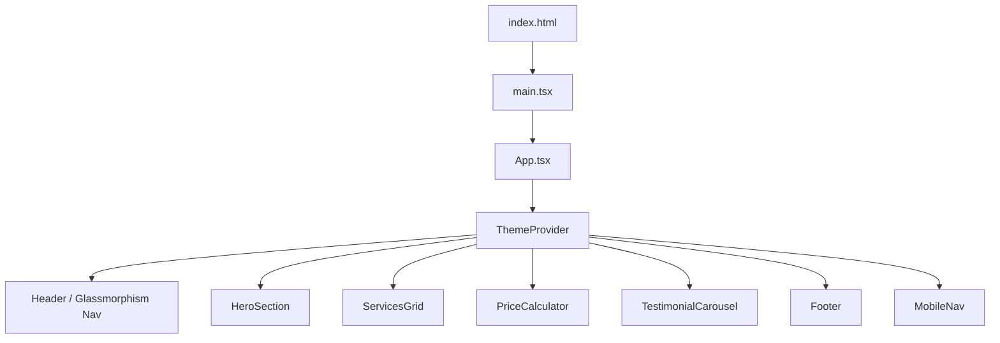

# Design Document: Stellies iCafe Website Redesign

## Overview

This design describes the architecture and component structure for the stelliesicafe.com redesign — a modern, single-page React application styled with Tailwind CSS. The site serves as a marketing and information hub for Stellies iCafe, featuring service listings, a printing price calculator, testimonials, and contact information. It supports Light/Dark Mode theming with a branded "Stellies Green" (#009933) palette, uses Framer Motion for animations, and follows a mobile-first responsive approach.

The application is a client-side rendered SPA with no backend requirements. All state (theme preference) is persisted via `localStorage`. The price calculator operates entirely client-side with static pricing data.

## Architecture

The application follows a standard React SPA architecture bootstrapped with Vite for fast development and optimized production builds.



**Key architectural decisions:**

- **Vite + React + TypeScript**: Fast build tooling, type safety, and modern DX.
- **Tailwind CSS**: Utility-first styling with built-in dark mode support via the `class` strategy, toggled by adding/removing `dark` on the `<html>` element.
- **Framer Motion**: Declarative animation library that integrates naturally with React components and supports `prefers-reduced-motion`.
- **Lucide React**: Tree-shakeable icon library — only icons used are bundled.
- **No routing library**: Single-page marketing site with no multi-page navigation. Smooth scroll anchors handle in-page navigation.
- **No state management library**: React Context is sufficient for the single piece of shared state (theme). Component-local state handles everything else.

## Components and Interfaces

### Component Tree

```
App
├── ThemeProvider (context)
├── Header
│   ├── Logo
│   ├── NavLinks (desktop)
│   ├── ThemeToggle
│   └── MobileMenuButton
├── MobileNav (mobile overlay/bottom bar)
├── HeroSection
│   ├── HeroImage
│   └── LiveStatusBadge
├── ServicesGrid
│   └── ServiceCard (×6)
├── PriceCalculator
├── TestimonialCarousel
│   └── TestimonialCard (×N)
└── Footer
```

### Component Interfaces

```typescript
// Theme context
interface ThemeContextValue {
  theme: 'light' | 'dark';
  toggleTheme: () => void;
}

// Service card data
interface Service {
  id: string;
  title: string;
  description: string;
  icon: string; // Lucide icon name
}

// Price calculator
interface PriceConfig {
  bw: number;   // price per page B&W
  color: number; // price per page Color
}

type PrintType = 'bw' | 'color';

interface CalculatorState {
  printType: PrintType;
  pageCount: string; // string to handle input state
  totalPrice: number | null;
  error: string | null;
}

// Testimonial
interface Testimonial {
  id: string;
  name: string;
  text: string;
  rating?: number;  // 1-5, optional
  avatar?: string;  // URL, optional
}

// Live status
interface CafeStatus {
  isOpen: boolean;
  label: string;
}
```

### Key Component Behaviors

**ThemeProvider**
- Reads initial theme from `localStorage` key `stellies-theme`, defaults to `'light'`.
- On toggle, updates state, writes to `localStorage`, and adds/removes `dark` class on `document.documentElement`.

**Header**
- Desktop: Glassmorphism effect via `backdrop-blur-md bg-white/70 dark:bg-slate-900/70`.
- Mobile: Simplified header with hamburger/menu button.
- `ThemeToggle` renders Sun icon in dark mode, Moon icon in light mode.

**PriceCalculator**
- Validates `pageCount`: must be a non-negative integer. Non-numeric or negative values show an error message and suppress calculation.
- Zero pages → displays R0.00.
- Calculation: `totalPrice = pricePerPage[printType] * pageCount`.
- Updates in real-time on input change (controlled component, no submit button).

**TestimonialCarousel**
- Mobile: shows 1 card, swipeable via touch gestures (Framer Motion drag).
- Desktop: shows 3 cards, navigable via arrow buttons.
- Wraps around at boundaries.

**ServicesGrid**
- Static data array of 6 services.
- Viewport-based staggered fade-in via Framer Motion `whileInView`.
- Hover lift via `whileHover={{ y: -4 }}`.

## Data Models

All data is static and client-side. No database or API is involved.

### Services Data

```typescript
const services: Service[] = [
  { id: 'printing', title: 'Document Services', description: 'Printing & Scanning', icon: 'Printer' },
  { id: 'photos', title: 'ID/Visa Photos', description: 'Professional ID and visa photographs', icon: 'Camera' },
  { id: 'gaming', title: 'PC Usage & Gaming', description: 'High-speed internet and gaming PCs', icon: 'Monitor' },
  { id: 'psira', title: 'PSIRA Renewals', description: 'PSIRA registration and renewal assistance', icon: 'ShieldCheck' },
  { id: 'courier', title: 'Courier Services', description: 'Send and receive parcels', icon: 'Truck' },
  { id: 'training', title: 'Skillwise Computer Training', description: 'Computer literacy courses', icon: 'GraduationCap' },
];
```

### Pricing Data

```typescript
const priceConfig: PriceConfig = {
  bw: 2.00,    // ZAR per page
  color: 5.00, // ZAR per page
};
```

### Testimonials Data

```typescript
const testimonials: Testimonial[] = [
  // Static array of testimonial objects
  // Populated with real client testimonials
];
```

### Theme Persistence

- Key: `stellies-theme`
- Values: `'light'` | `'dark'`
- Storage: `window.localStorage`


## Correctness Properties

*A property is a characteristic or behavior that should hold true across all valid executions of a system — essentially, a formal statement about what the system should do. Properties serve as the bridge between human-readable specifications and machine-verifiable correctness guarantees.*

### Property 1: Theme toggle and persistence round-trip

*For any* starting theme value (`'light'` or `'dark'`), toggling the theme should produce the opposite value, persist it to `localStorage`, and reading from `localStorage` should return that new value. Toggling again should restore the original theme.

**Validates: Requirements 3.6, 3.7**

### Property 2: Live status badge displays correct status

*For any* `CafeStatus` object, the `LiveStatusBadge` component should render text that matches the `label` field and visually indicate the `isOpen` state (e.g., green for open, red/gray for closed).

**Validates: Requirements 4.3**

### Property 3: Service card renders all required fields

*For any* `Service` object with a title, description, and icon name, the rendered `ServiceCard` component output should contain the service title and description text.

**Validates: Requirements 5.2**

### Property 4: Price calculation correctness

*For any* valid print type (`'bw'` or `'color'`) and any non-negative integer page count, the calculated total price should equal `priceConfig[printType] * pageCount`.

**Validates: Requirements 6.3**

### Property 5: Invalid price input rejection

*For any* string that is non-numeric, represents a negative number, or contains decimal values, the price calculator should produce an error state and not display a calculated price.

**Validates: Requirements 6.4**

### Property 6: Testimonial card renders all required fields

*For any* `Testimonial` object with a name and text, the rendered `TestimonialCard` component output should contain the client's name and testimonial text.

**Validates: Requirements 7.4**

### Property 7: Animation durations within performance budget

*For any* Framer Motion animation configuration used in the application, the `duration` value should be at most 0.5 seconds (500 milliseconds).

**Validates: Requirements 9.4**

### Property 8: All images have alt text

*For any* `` element rendered by the application, the element should have a non-empty `alt` attribute.

**Validates: Requirements 10.3**

### Property 9: Color contrast compliance

*For any* text color and background color pair defined in the application's theme configuration, the WCAG contrast ratio should be at least 4.5:1.

**Validates: Requirements 10.5**

## Error Handling

| Scenario | Handling |
|---|---|
| Invalid page count input (non-numeric, negative) | Display inline validation message below input; suppress price calculation; do not throw |
| `localStorage` unavailable (private browsing) | Catch exception, fall back to default `'light'` theme; app remains functional |
| Image fails to load | Use `alt` text as fallback; optionally show a placeholder background |
| Framer Motion not loaded | Components render without animation; no functional breakage (animations are progressive enhancement) |
| Missing testimonial data | Carousel renders with available cards; empty array shows nothing gracefully |
| Browser does not support `backdrop-filter` | Header falls back to solid semi-transparent background via CSS fallback |

## Testing Strategy

### Unit Tests

Unit tests cover specific examples, edge cases, and integration points:

- **ThemeToggle**: Renders sun icon when theme is `'dark'`, moon icon when theme is `'light'`.
- **PriceCalculator**: Zero pages returns R0.00. Specific known inputs (e.g., 10 color pages = R50.00).
- **PriceCalculator edge cases**: Empty string input, whitespace input, decimal input, extremely large numbers.
- **Footer**: Contains address "38 Libertas Building", email "info@stelliesicafe.com", WhatsApp link.
- **ServicesGrid**: Renders exactly 6 `ServiceCard` components.
- **Lazy loading**: All `` elements have `loading="lazy"` attribute.
- **Semantic HTML**: Page contains `<header>`, `<main>`, `<nav>`, `<section>`, `<footer>` elements.
- **Reduced motion**: When `prefers-reduced-motion: reduce` is active, animations are disabled or minimized.
- **Keyboard navigation**: Interactive elements (buttons, links, toggle) are focusable and operable via keyboard.

### Property-Based Tests

Property-based tests use **fast-check** (JavaScript PBT library) with a minimum of 100 iterations per property. Each test references its design property.

| Test | Property | Tag |
|---|---|---|
| Theme round-trip | Property 1 | `Feature: stellies-icafe-redesign, Property 1: Theme toggle and persistence round-trip` |
| Status badge label | Property 2 | `Feature: stellies-icafe-redesign, Property 2: Live status badge displays correct status` |
| Service card fields | Property 3 | `Feature: stellies-icafe-redesign, Property 3: Service card renders all required fields` |
| Price calculation | Property 4 | `Feature: stellies-icafe-redesign, Property 4: Price calculation correctness` |
| Invalid input rejection | Property 5 | `Feature: stellies-icafe-redesign, Property 5: Invalid price input rejection` |
| Testimonial card fields | Property 6 | `Feature: stellies-icafe-redesign, Property 6: Testimonial card renders all required fields` |
| Animation durations | Property 7 | `Feature: stellies-icafe-redesign, Property 7: Animation durations within performance budget` |
| Image alt text | Property 8 | `Feature: stellies-icafe-redesign, Property 8: All images have alt text` |
| Color contrast | Property 9 | `Feature: stellies-icafe-redesign, Property 9: Color contrast compliance` |

### Test Tooling

- **Vitest**: Test runner (fast, Vite-native)
- **React Testing Library**: Component rendering and DOM queries
- **fast-check**: Property-based testing library
- **jsdom**: Browser environment simulation for tests

Each property-based test MUST be implemented as a single `fc.assert(fc.property(...))` call with at least `{ numRuns: 100 }`.
